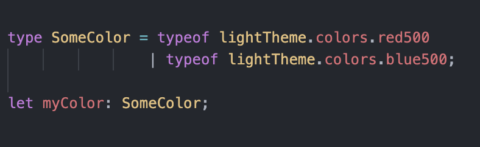
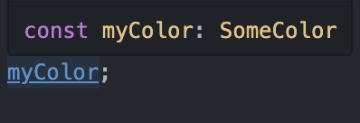
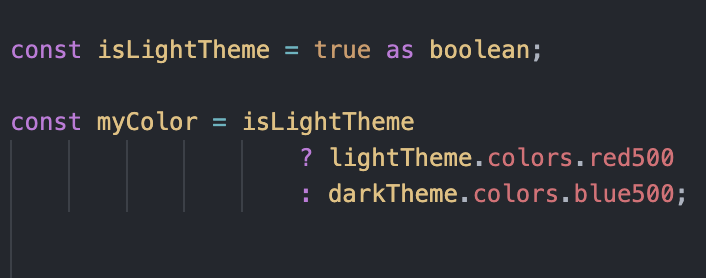
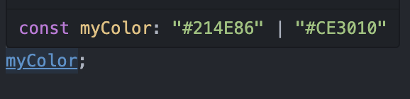
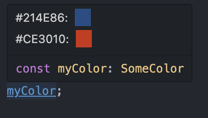
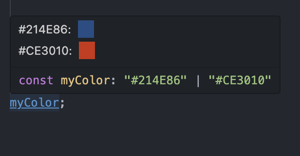

# TS Type Color Preview

This extension allows previewing the colors of typescript types and union types that correspond to color values

## Features

Hover on a variable with a color value as its type to see a preview of the possible colors

### Before

### After

## Notes

This extension was inteded for my own uses and is essentially just a proof of concept for now, but I'm planning to support other color formats in the near future and enhance the caching behavior.

## Known Issues

- Currently only works with Hex values (#FFFFFF) (#FFF) (#FFFFFFAA).
- Types originating files other than the active one might be cached and not up to date with the latest changes.

## Release Notes

### 0.0.4

Better representation of transparent colors

### 0.0.1

Initial release

---

**Enjoy!**
