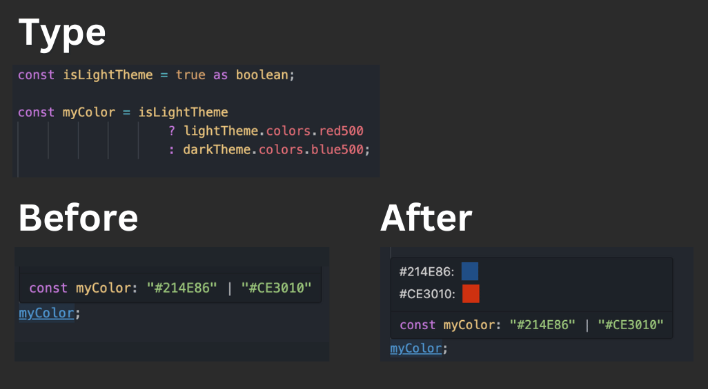
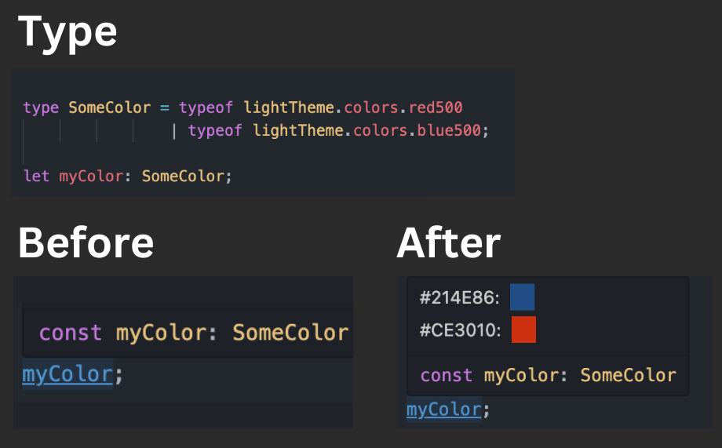

# TS Type Color Preview

[](https://marketplace.visualstudio.com/items?itemName=rodsarhan.tstypecolorpreview) [](https://github.com/RodSarhan/tstypecolorpreview) [](https://marketplace.visualstudio.com/items?itemName=rodsarhan.tstypecolorpreview) [](https://github.com/RodSarhan/tstypecolorpreview/blob/main/LICENSE)

A Visual Studio Code extension that provides instant color previews for TypeScript types and union types containing color values. Perfect for React, React Native, and other TypeScript projects where colors are defined as types.

## ✨ Features

- **Color Variables Previews**: Hover over variables that represent a color value to see visual previews of all their possible colors
- **Multiple Color Formats**: Supports hex, RGB, HSL, and named colors
- **TypeScript Integration**: Leverages TypeScript's language server for color detection
- **Zero Configuration**: Works out of the box with any TypeScript project

## 📖 Usage

Simply hover over any variable that has a color value as its type. The extension will automatically display a color preview popup.

### Examples

```typescript
const buttonColor = isLightTheme ? lightTheme.primary : darkTheme.primary

const MyButton = () => {
  return <Button style={{ backgroundColor: buttonColor }}/>
                 // Hover over buttonColor ^ to see the possible colors
}
```

### Screenshot 1



### Screenshot 2



## 🚀 Installation

### From VS Code Marketplace

1. Open VS Code
2. Go to Extensions (`Ctrl+Shift+X` or `Cmd+Shift+X`)
3. Search for "TS Type Color Preview"
4. Click Install

Or simply follow the link at the top of the repo

### From Command Line

```bash
code --install-extension rodsarhan.tstypecolorpreview
```

### Links

Microsoft VS Code Marketplace:

[https://marketplace.visualstudio.com/items?itemName=rodsarhan.tstypecolorpreview](https://marketplace.visualstudio.com/items?itemName=rodsarhan.tstypecolorpreview)

Open VSX:

[https://open-vsx.org/extension/rodsarhan/tstypecolorpreview](https://open-vsx.org/extension/rodsarhan/tstypecolorpreview)

## 🔧 Requirements

- TypeScript project
- File extension must be `.ts`, `.tsx`, `.js`, or `.jsx`

## 🐛 Troubleshooting

### Color not showing correctly?

- Ensure color values are valid CSS colors
- Ensure that the hovered variable type is a color and not a generic string

## 🤝 Contributing

This extension is intended for my personal use, and i work on it in my free time when needed, But contributions are welcome! If you encounter any issues or have suggestions for improvements:

1. Check existing [issues](https://github.com/RodSarhan/tstypecolorpreview/issues)
2. Create a new issue with detailed information
3. Pull requests are appreciated

## 📄 License

This project is licensed under the MIT License - see the [LICENSE](LICENSE) file for details.

## 🙏 Acknowledgments

- Inspired by [Prettify TypeScript](https://github.com/mylesmmurphy/prettify-ts)
- [mylesmmurphy](https://github.com/jpudysz) for his support and examples

---

Enjoy coding with visual color feedback! 🎨
